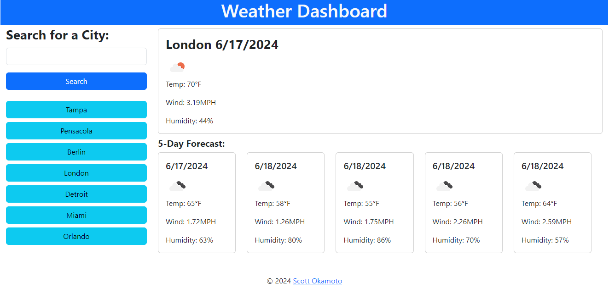

# 5-Day Weather App

The 5-Day Weather App provides users with current weather conditions and a 5-day forecast for any searched city. Simply enter a city name to receive detailed weather information, including temperature, wind speed, humidity, and weather icons for easy visualization. The app also maintains a search history, allowing users to quickly access previously searched cities with a single click. This feature ensures efficient and user-friendly navigation, making it simple to retrieve weather updates for frequently checked locations.

[Link to deployed site](https://swokamoto.github.io/weather/)

## Author

Scott Okamoto
Launched on 17-JUN-2024

## Support

Please contact Scott Okamoto: swokamoto@gmail.com for any concerns.